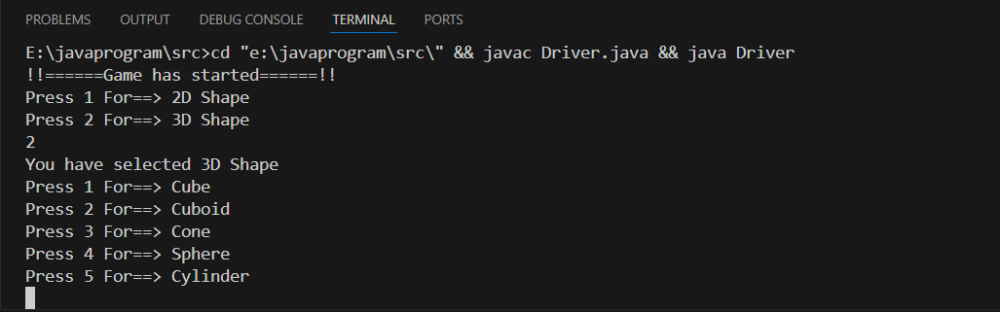
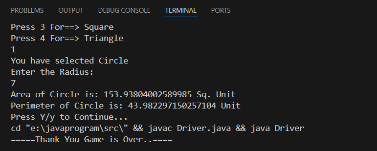
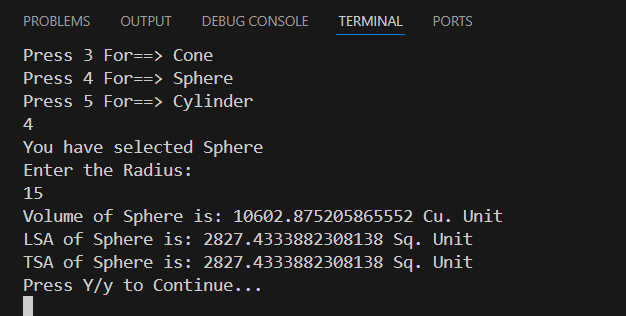

# 2D & 3D Shape Calculator using Java

## 📌 Project Description
This is a menu-driven Java console application that allows users to select
2D or 3D shapes and calculate their properties such as area, perimeter,
surface area, and volume. The project is built using Core Java and
demonstrates the use of Object-Oriented Programming (OOP) concepts.

---

## 🚀 Features
- Menu-driven console-based application
- Supports multiple 2D shapes (Circle, Rectangle, etc.)
- Supports multiple 3D shapes (Sphere, Cylinder, etc.)
- Calculates area and perimeter for 2D shapes
- Calculates surface area, curved surface area and volume for 3D shapes
- Uses method overriding and runtime polymorphism
- Clean and modular class structure

---

## 🧠 OOP Concepts Used
- Inheritance
- Method Overriding
- Runtime Polymorphism
- Abstraction
- Encapsulation

---

## 🛠 Technologies Used
- Language: Java (Core Java)
- IDE: VS Code
- JDK: JDK 21

---

## ▶️ How to Run the Project
1. Clone the repository
2. Open the project in any Java IDE
3. Navigate to the `src` folder
4. Compile and run the `Drive.java` file
5. Follow the on-screen menu to select shapes and view results

---

## 📸 Sample Output Screenshots

### Main Menu

### 2D Shape Output

### 3D Shape Output

